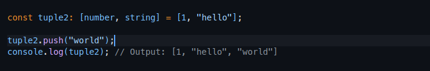

# learn-typescript

## Tuples

Tuples are a method of defining a type that has a finite number of unnamed properties, with each property having an associated type.When using a tuple, all of the properties must be provided.

### Why typescript not throw error

> 

### The Core Issue

While tuples are meant to have a fixed length, TypeScript (as of current versions) doesn't prevent array methods like push() from being called on tuples. This is a deliberate design choice with historical reasons.

### Why TypeScript Allows This

1. Backward Compatibility: Tuples are built on top of JavaScript arrays, and completely preventing array methods would break too much existing code.

2. Practical Flexibility: In real-world scenarios, sometimes you need to work with tuples that might have additional elements, even if the type system only recognizes the first N elements.

3. Type vs Runtime Behavior: TypeScript's type checking happens at compile-time, not runtime. The push() operation happens at runtime.

### How to Enforce Strict Tuples

1. Use `as const` for readonly tuples

```javascript

const tuple2 = [1, "hello"] as const;
// tuple.push("world"); // Property 'push' does not exist on type 'readonly [1, "hello"]'.
console.log(tuple); // Output: [1, "hello"]

```

2.Use TypeScript's `readonly` tuples

```javascript

const tuples2: readonly [string, number] = ["Alice", 30];
// tuples.push("Bob"); //Property 'push' does not exist on type 'readonly [string, number]'.
console.log(tuples); // Output: ["Alice", 30]

```
